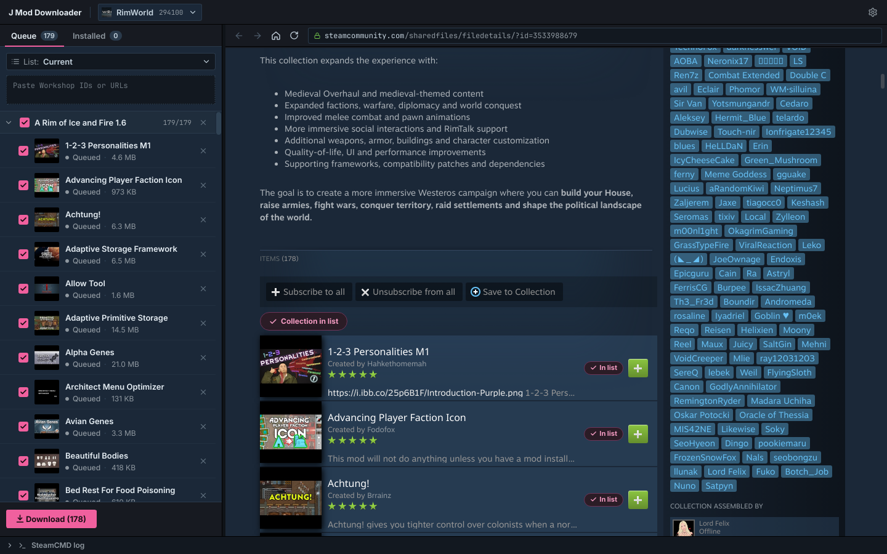

# J Mod Manager

Manage and download Steam Workshop mods for any game. Turn mods on and off, sort load order, keep modsets, and grab mods or whole collections from the Workshop without subscribing.

Works on **Windows** and **Linux**.



---

## Features

### Manage
- **Inactive / Active columns**: drag mods between them, reorder by dragging, or double-click to switch. Nothing touches the game until you press **Apply**, and **Revert** undoes the edit.
- **Every mod the game can see**: mods downloaded here, mods you dropped into the mod folder yourself, and Steam subscriptions.
- **Load order and auto-sort** (RimWorld): sorts by each mod's own rules (`loadAfter`, `loadBefore`, dependencies), with Harmony, Core and the DLCs pinned on top.
- **Warnings**: missing or inactive dependencies, wrong order, incompatible mods, mods made for another game version, duplicates. **Fix all** activates dependencies, downloads missing ones and sorts. Warnings never block you.
- **Modsets**: save the active list under a name and switch between setups. Import a `ModsConfig.xml` or a `.txt` list, export to `.txt`. Mods a modset needs but you don't have are downloaded and join the list when they arrive.
- **Updates**: outdated mods get a badge. Update one from its details, or **Update all**.
- **Details panel**: preview, author, version, dependencies (click to jump), folder and Workshop page. Delete mods you no longer want.
- **Play** through Steam or a custom executable with arguments.

### Download
- **Built-in Workshop browser** with an editable address bar: every mod tile, mod page and collection gets a **+ Add** button. Type a URL, a Workshop ID or search words.
- **Collections in one click**: a collection lands in your queue as a group. Untick anything you don't want.
- **Dependencies are added for you**: a mod's *Required items* are queued automatically and shown under it.
- **Batch download** with SteamCMD, with automatic retries for timeouts. New mods arrive in **Inactive**.
- **Import lists into the queue**: `.txt`, plus RimWorld `.rml`, saves and `ModsConfig.xml`. Export the queue to `.txt`.

### Everywhere
- **Per-game profiles**: each game has its own mod folder, queue and modsets. Find games by name, from the ones installed on your PC, or paste an AppID, a store link or any Workshop link.
- **Copy, hardlink or link**: mods are copied into the game's mod folder, hardlinked (no extra space, real folders; the cache must be on the same drive) or linked (symlink / junction).
- **No setup hunt**: SteamCMD is found automatically, or installed for you on first run.

### What each game gets

| | RimWorld | Tabletop Simulator | Other games |
|---|---|---|---|
| Turn mods on/off | `ModsConfig.xml` | `<id>.json` in `Mods/Workshop` + `WorkshopFileInfos.json` | the mod's folder is in the mod folder or not |
| Load order, auto-sort | yes | no | no |
| Steam subscriptions | on/off and order | the ones TTS saved are listed and switchable | listed only (the game loads them itself) |
| Warnings | all of the above | duplicates only | duplicates only |

Tabletop Simulator Workshop items are single BSON files: they're converted to the JSON save TTS reads, get a 256×256 thumbnail and an entry in `WorkshopFileInfos.json`, the list TTS reads its Workshop games from.

---

## Download

Grab the latest build from [Releases](https://github.com/Jopseps/Jopseps-mod-manager/releases):

- **Windows**: `JModManager-Windows.zip`. Extract it, run `JModManager.exe`.
- **Linux**: `JModManager-Linux.tar.gz`. Extract it, run `JModManager/JModManager`.

### Run from source

Needs Python 3.11+.

```bash
pip install -r requirements.txt
python -m jmd
```

---

## How to use

1. **First run**: the setup finds SteamCMD (or downloads it), then asks which game you mod and where its mod folder is.
2. **Get mods**: switch to **Download** (top bar, or `Ctrl+2`), browse the Workshop and click **+ Add**. You can also paste Workshop IDs or links into the box on the left. Press **Download**.
3. **Set them up**: switch to **Manage** (`Ctrl+1`). New mods are in **Inactive**: drag them to **Active**, press **Auto-sort** if the game has a load order, then **Apply** (`Ctrl+Enter`).
4. **Save the setup** as a modset from the menu next to *Active*, and press **Play**.
5. **Keep them fresh**: Manage checks for updates once per session. Press **Update all** when it shows up.

If RimWorld's `ModsConfig.xml` isn't found (start the game once, or it's in an unusual place), set its path under the profile menu → **Profile settings…**. The game folder and the Play button are set there too.

### Games that need you to own them

Most games let SteamCMD download Workshop items anonymously. Some (Wallpaper Engine, for example) only allow accounts that own the game. Those rows show **Needs login**: click **Log in**, enter your Steam account and your Steam Guard code if asked.

Your password is handed to SteamCMD for that one run and never saved. SteamCMD remembers the session afterwards.

### Where files go

SteamCMD downloads into the app's own cache (`~/.local/share/jmod/cache` on Linux, `%LOCALAPPDATA%\jmod\cache` on Windows), and mods are then copied, hardlinked or linked into the mod folder of your profile, one folder per Workshop ID. Keeping the cache means updates only fetch what changed.

For games without a mod config file, a mod you switch off is moved next to the mod folder (`Mods.jmm-disabled/`), or just unlinked when the profile uses links (the cache keeps it). RimWorld mods stay where they are and only `ModsConfig.xml` changes. Tabletop Simulator mods move to `Workshop.jmm-disabled/` with their `WorkshopFileInfos.json` entry. A backup of it is kept in the profile's `backups/` folder before the first Apply of each session.

---

## Adding support for a game

Most games work as-is with the generic handler (mods on/off by folder, no load order). To give a game the full treatment, add a handler in `jmd/handlers/` by subclassing `jmd.handlers.base.GameHandler` (for frozen builds, also add the module to `hiddenimports` in `jmd.spec`). It can:

- read and write the game's mod list formats (`import_list`, `export_list`, `import_modset`),
- say where mods are and what they need (`scan` → `ModEntry` with dependencies and load rules),
- read and write the active list (`read_active`, `write_active`, `config_path`), with `supports_order` for load order and `tier` for pinned mods,
- tell the game version and whether the game is running (`game_version`, `process_names`).

RimWorld's handler (`jmd/handlers/rimworld.py` + `jmd/core/rimworld.py`) is the example.

## Self-test

Something off on your PC? Run `JModManager --selftest` (or `python -m jmd.selftest`). It checks folders, sync modes, SteamCMD downloads, the TTS conversion and thumbnails in a temp folder, without touching your profiles or mod folders, and writes the report to `selftest.txt` in the data folder (the Windows build opens it when done).

## Building

Only Python 3 is needed. The scripts create a `.venv`, install the dependencies there, run the tests and build.

- **Linux:** `./build.sh` → `dist/JModManager/JModManager` + `dist/JModManager-Linux.tar.gz`
- **Windows:** double-click `build.bat` → `dist\JModManager\JModManager.exe` + `dist\JModManager-Windows.zip`

A local build bundles your PC's libraries, so it runs on that PC (and on newer systems). Tagging `v*` builds the Windows and Linux releases through GitHub Actions on older runners, so they run on more systems.

---

## Confirmed Steam Workshops That Downloadable
**NOTE:** Theoretically, it can download from any workshop. However, for games that have separate workshop IDs for singleplayer and multiplayer (or use a dedicated server, like Stonehearth), it might not be able to download from them.

- **RimWorld**  `294100`
- **Tabletop Simulator** `286160`
- **Project Zomboid** `108600`
- **Half Life 2** `220`

---

## Changelog

### Version 2.0 (unreleased)
- Now **J Mod Manager**: a Manage view with Inactive / Active columns, staged Apply / Revert, load order with auto-sort (RimWorld), warnings with fixes, modsets, update badges, delete, and Play.
- Hardlink sync mode, editable browser address bar, per-profile settings.
- New desktop app (PySide6) replaces the terminal scripts.
- Embedded Workshop browser with **+ Add** buttons on mods and collections.
- Collections, automatic dependencies, list import/export.
- Update tracking and *Update all*.
- Per-game profiles, game search and installed-game detection. Profiles can also be made from an AppID, a store link or a Workshop link.
- SteamCMD auto-install, retries, login fallback for ownership-gated games.

### Version 1.1 (2026-02-24)
- Added smart config validation.
- Added save to config option and entered values can be saved to `config.ini` for future sessions
- Full URL pasting support (the `&` character in URLs no longer causes issues on Windows)
- `Q` now responds instantly without needing to enter.

### Version 1.0 (2025-10-08)
- Initial release

---

### Special Thanks to
- [Swjeer](https://github.com/Swjeer) for testing the Windows version.

---

## License

**J Mod Manager**: Copyright (C) 2025-2026 Yusuf Mert Turan

This program is free software: you can redistribute it and/or modify it under the terms of the GNU Affero General Public License as published by the Free Software Foundation, either version 3 of the License, or (at your option) any later version.

This program is distributed in the hope that it will be useful, but WITHOUT ANY WARRANTY; without even the implied warranty of MERCHANTABILITY or FITNESS FOR A PARTICULAR PURPOSE. See the GNU Affero General Public License for more details.

You should have received a copy of the GNU Affero General Public License along with this program (see [LICENSE](LICENSE)). If not, see <https://www.gnu.org/licenses/>.

Contact: [yusufmertturan@gmail.com](mailto:yusufmertturan@gmail.com)

### Third-party
- [Inter](https://rsms.me/inter/) and [JetBrains Mono](https://www.jetbrains.com/lp/mono/) fonts: SIL Open Font License 1.1 (`jmd/assets/fonts/OFL-*.txt`).
- Icon paths from [Lucide](https://lucide.dev) (ISC) and Feather (MIT): `jmd/assets/LICENSE-Lucide.txt`.
